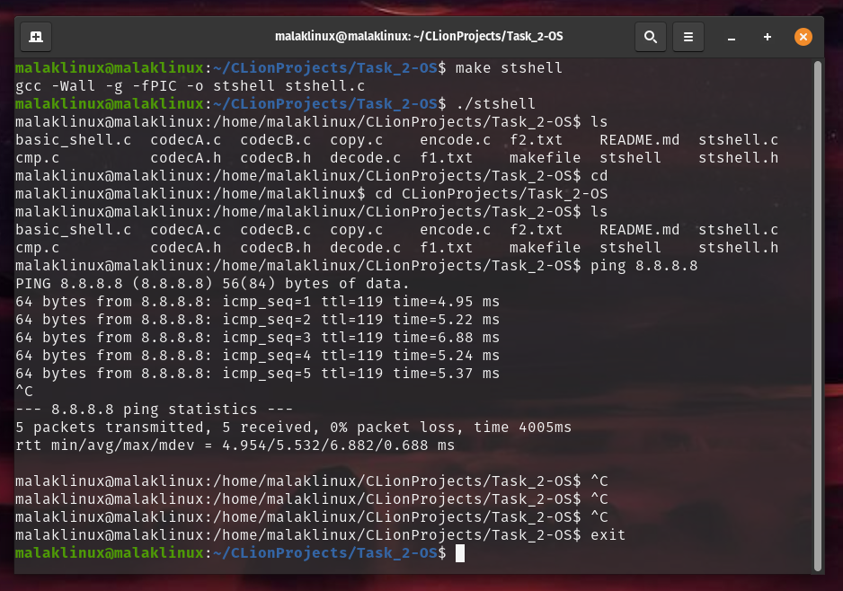
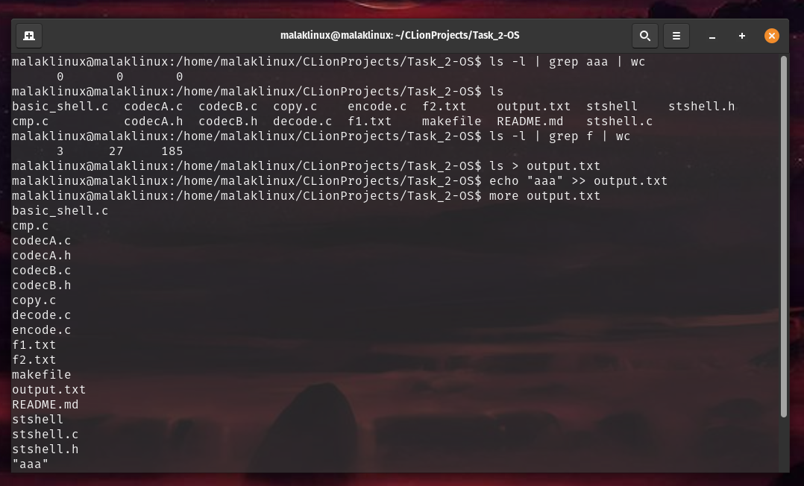

# STShell (Student Shell)

STShell is a simple shell program for Linux, designed to provide basic functionality such as running CMD tools, handling
signals, output redirection, and piping.

---

## System Environment

This shell program is designed to run on `Linux systems`. The specific flavor of Linux is not restricted as long as the
system supports the standard libraries and system calls used in the code.

---

## Usage

* ### Running CMD tools
  STShell can run CMD tools that already exist on the system using the fork, exec, and wait system calls. Simply type
  the command followed by its arguments and press Enter to run the tool.

* ### Stopping running tool with Ctrl+C
  Pressing `Ctrl+C` will stop the currently running tool **without killing** the shell itself. The shell uses a signal handler
  to handle the SIGINT signal generated by Ctrl+C.

* ### Redirecting output and piping
  STShell supports output redirection using the ">" and ">>" symbols. It also allows piping with the "|" symbol,
  supporting up to two consecutive pipes. For example, the command `ls -l | grep aaa | wc is` supported.

* ### Exiting the shell
  To stop the shell, simply type the `exit` command and press Enter.

---

## Compilation

To compile the shell program, use the following command in the terminal:
`gcc -o stshell stshell.c`

This will create an executable file named `stshell`.

---

## Running

To run the STShell, execute the following command in the terminal: `./stshell`

This will start the shell, and you can begin using the supported features.

---

## Shell Screenshots

### Commands: `make stshell` , `ls` , `cd` , `cd + path` , `ping 8.8.8.8` + `CTRL+C` , `exit`

---

### Commands: `ls -l | grep aaa | wc` , `ls` , `ls -l | grep f | wc` , `ls > output.txt` , `echo "aaa" >> output.txt` , `more output.txt`

